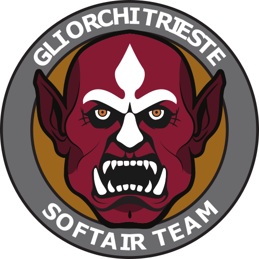

# A.S.D. Gli Orchi Trieste - Softair Team

The official website for the italian airsoft team, A.S.D. Gli Orchi Trieste - Softair Team. The result can be seen at [this link](https://orchisoftair-website.vercel.app/).
 
Currently, the website, is italian-only and there are no plans for localization but in can be easilly acheved using libraries like [i18n](https://nextjs.org/docs/pages/guides/internationalization).
